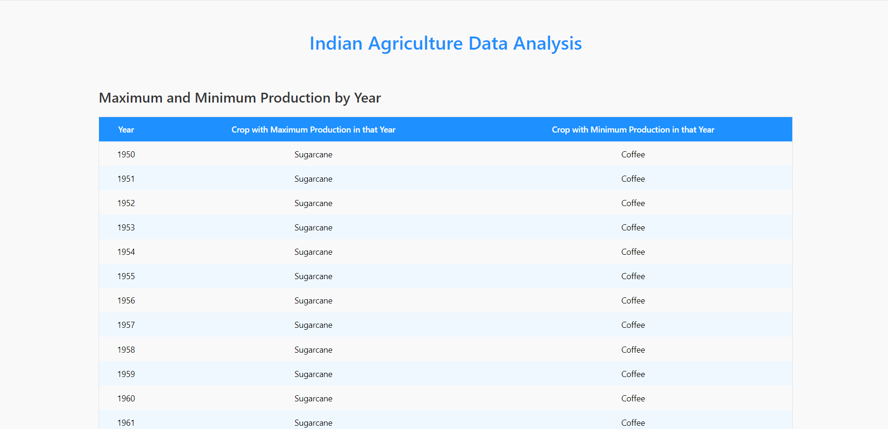
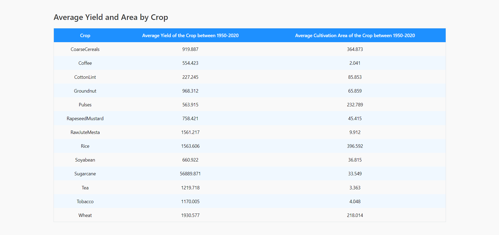

# Indian Agriculture Data Analysis

This project analyzes Indian agricultural data, specifically crop production, yield, and cultivation area. The application displays two key tables:

Maximum and Minimum Production by Year – Shows the crop with the highest and lowest production each year.

Average Yield and Area by Crop – Calculates the average yield and cultivation area for each crop from 1950 to 2020.

## Features

- Data Aggregation :- Calculates maximum, minimum, and average values.
- Mantine UI :- Uses Mantine for a clean, responsive table layout.

## Functionality
- Table 1 :- Maximum and Minimum Production by Year – Displays the crop with the highest and lowest production each year.
- Table 2 :- Average Yield and Area by Crop – Shows the average yield and area from 1950 to 2020.

## Prerequisites

- Node.js (v14 or higher)

- Yarn/npm

- Git


## Run Locally

Clone the project

```bash
  https://github.com/monurajputrko/Manufac-Assignment.git
```

Go to the project directory

```bash
  cd my-project
```

Install dependencies

```bash
  yarn install
```

Start the server

```bash
  yarn start
```


## Screenshots

### Maximum and Minimum Production by Year



### Maximum and Minimum Production by Year


